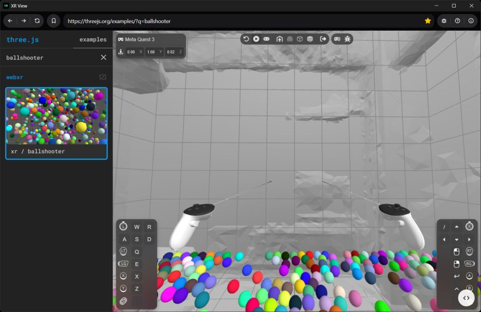

# XR View


A WebXR emulator for the desktop. Navigate any WebXR app, no headset or extensions required.

Run any WebXR application locally with emulated VR hardware (Meta Quest 3 by default), powered by [IWER](https://github.com/meta-quest/immersive-web-emulation-runtime) (Immersive Web Emulation Runtime).

## ⚠ Disclaimer


```
This is a development tool, not a general-purpose web browser.
Use at your own risk. It loads untrusted web content in an OS webview.
The author(s) make no guarantees about security, stability, or fitness for any particular purpose.
```

See the [LICENSE](LICENSE) file for terms.



## Why This Exists

Chrome's [Immersive Web Emulator](https://chromewebstore.google.com/detail/immersive-web-emulator/cgffilbpcibhmcfbgggfhfolhkfbhmik) Extension (also built by Meta, the same team behind IWER) is the standard way to develop WebXR on desktop.

My corporate environment disables all Chrome extensions and the entire Chrome Web Store via admin policies, which means Meta's Immersive Web Emulator is completely unavailable to me, so I built a standalone alternative using the same runtime.

XR View is a standalone application that needs no extensions, renders the XR controls in the same window as the content, and supports walking emulation (Shift + WASD locomotion) out of the box because it uses the IWER runtime.

## XR Controls

XR View uses [IWER](https://github.com/meta-quest/immersive-web-emulation-runtime) to emulate a VR headset and controllers with keyboard and mouse. Click the **Help** button in the toolbar (or press it again to dismiss) to see these controls in-app.

| Action | Input |
|--------|-------|
| Enter Play Mode | Click the **Play** button in the IWER overlay |
| Look around | Move the mouse |
| Walk | Hold **Shift** + **W** / **A** / **S** / **D** |
| Right controller trigger | Left click |
| Left controller trigger | Right click |
| Exit Play Mode | **Esc** |

> Play Mode is IWER's pointer-lock state. While active, mouse movement controls the headset orientation and WASD moves the emulated player through the scene. Press Esc to release the pointer and return to normal browser interaction.

## Architecture

The app is built with [Tauri v2](https://tauri.app/) (Rust backend + React frontend) and uses **multi-webview**, an experimental Tauri feature that places multiple webviews inside a single OS window.

```
┌────────────────────────────────────────────────┐
│  OS Window ("main")                            │
│ ┌────────────────────────────────────────────┐ │
│ │  toolbar webview  (React SPA, 50px)        │ │
│ │  URL bar + nav buttons + bookmarks + info  │ │
│ ├────────────────────────────────────────────┤ │
│ │                                            │ │
│ │  browser webview  (external URLs)          │ │
│ │  XR polyfill injected into every frame     │ │
│ │                                            │ │
│ └────────────────────────────────────────────┘ │
└────────────────────────────────────────────────┘
```

**Two webviews, different trust levels:**

- **`toolbar`** = Loads the local React SPA.  
This is the *only* webview with Tauri IPC access (defined in `src-tauri/capabilities/default.json`).  
It invokes Rust commands like `navigate`, `go_back`, `reload`, etc.
- **`browser`** = Loads arbitrary external URLs.  
Has **zero** Tauri capabilities.  
It's a plain OS webview (WebView2 on Windows, WebKit on macOS/Linux).  
A bundled initialization script injects the IWER XR emulation runtime into every page, providing `navigator.xr` and emulated controllers.  
DevTools are enabled even in release builds (right-click → Inspect).

### Security: why the browser webview has no capabilities

Tauri was designed for apps that load **trusted** content.  
Loading untrusted websites in a webview that has IPC access to native commands would be a security risk because a malicious page could call Rust-side functions.  
XR View mitigates this by giving the `browser` webview **zero Tauri capabilities**: the `"webviews"` array in `src-tauri/capabilities/default.json` lists only `"toolbar"`, so the browser webview has no IPC bridge to exploit.  
It's effectively just a raw OS webview.

### XR Emulation

- `src/xr-inject.ts` configures an `XRDevice` (Meta Quest 3 profile), installs the IWER runtime, the DevUI overlay, and a synthetic environment. This file is bundled at build time by esbuild into `src-tauri/xr-emulator.js`.
- `lib.rs` uses `include_str!("../xr-emulator.js")` to embed the bundle at compile time and injects it into every frame of the browser webview via `initialization_script_for_all_frames`.

### Why `"unstable"`?

Multi-webview (`win.add_child(...)`) requires the `unstable` feature flag on the `tauri` crate. This is a Tauri v2 API that hasn't been stabilized yet.

## Prerequisites

- [Node.js](https://nodejs.org/) (LTS)
- [Rust](https://rustup.rs/) (stable)
- Tauri v2 system dependencies - see the [Tauri prerequisites guide](https://v2.tauri.app/start/prerequisites/)

## Getting Started

```bash
# Install JS dependencies
npm install

# Run in development mode (builds XR bundle, starts Vite + Tauri)
npm run tauri-dev

# Production build
npm run tauri-build
```

### Build Output

Build artifacts are written to the project-root-level `dist-debug/` and `dist-release/` directories (not inside `src-tauri/target/`). This is controlled by the `--target-dir` flag passed in the npm scripts.

### Build Scripts

| Script | What it does |
|--------|-------------|
| `npm run build-xr` | Copies `webxr-polyfill.min.js` from `node_modules` into `src-tauri/` and bundles `src/xr-inject.ts` → `src-tauri/xr-emulator.js` via esbuild |
| `npm run tauri-dev` | Runs `build-xr` first, then starts Vite dev server + Tauri (output in `dist-debug/`) |
| `npm run tauri-build` | Runs `build-xr` first, then builds the production app (output in `dist-release/`) |

Both generated files (`xr-emulator.js`, `webxr-polyfill.min.js`) are gitignored and regenerated on every build. A Vite plugin also generates `licenses.txt` (third-party license notices) in the frontend dist during production builds.

## Project Structure

```
src/                    # Frontend (React + TypeScript)
  App.tsx               # Toolbar UI (URL bar, nav, bookmarks, about dialog)
  App.css               # Toolbar styles
  main.tsx              # React entry point
  xr-inject.ts          # IWER setup - bundled into xr-emulator.js

src-tauri/              # Rust backend
  src/lib.rs            # Window setup, two webviews, Tauri commands
  src/main.rs           # Entry point (calls lib::run)
  Cargo.toml            # tauri with "unstable" feature
  capabilities/         # Tauri v2 capability definitions
    default.json        # IPC permissions scoped to toolbar webview only
  xr-emulator.js        # (generated) IWER bundle injected into browser
  webxr-polyfill.min.js # (generated) WebXR polyfill copied from node_modules

scripts/
  build-xr.mjs                    # Build script: copy polyfill + esbuild xr-inject
  vite-license-checker-plugin.ts   # Vite plugin: generates licenses.txt in dist/

dist-debug/             # Debug build output (via --target-dir)
dist-release/           # Release build output (via --target-dir)
```

## License

This project is licensed under the [MIT License](LICENSE).
